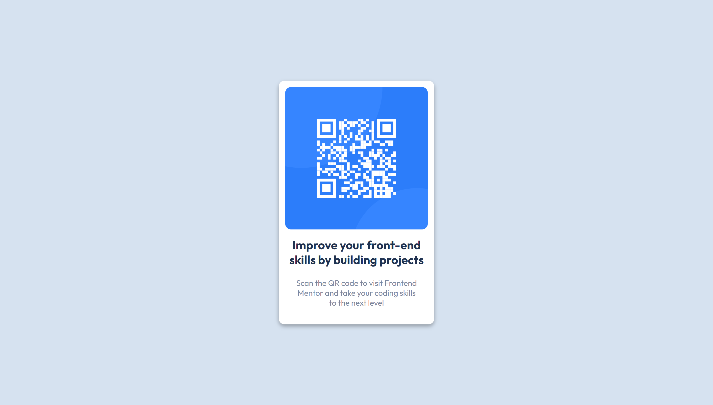

# Frontend Mentor - QR code component solution

This is a solution to the [QR code component challenge on Frontend Mentor](https://www.frontendmentor.io/challenges/qr-code-component-iux_sIO_H). Frontend Mentor challenges help you improve your coding skills by building realistic projects. 

## Table of contents

- [Overview](#overview)
  - [Screenshot](#screenshot)
  - [Links](#links)
- [My process](#my-process)
  - [Languages and Tools](#languages-and-tools)
  - [What I learnt](#what-i-learnt)
  - [Useful resources](#useful-resources)
- [Author](#author)

## Overview

### Screenshot

#### Mobile


#### Desktop




### Links

- Solution URL: [My Solution URL](https://github.com/iqra0001/QR-Code-Component-Challenge)
- Live Site URL: [My Live Site URL](https://iqra0001.github.io/QR-Code-Component-Challenge/)

## My process

### Languages and Tools

- HTML5
- CSS3
- Sublime Text 3

### What I learnt

Centering a div within a div.

```css
.main-container{
    width: 100vw;
    height: 100vh;
    display: flex;
    justify-content: center;
    align-items: center;
}
```

Using padding instead of a fixed height to make a div container responsive and prevent the text from overflow.

```css
.qr-code-box{
    width: 18em;
    padding: 0.8em;
}
```

### Useful resources

- [Conquering Responsive Layouts 21 Day Challenge by Kevin Powell](https://courses.kevinpowell.co/conquering-responsive-layouts) - Helped me to make my card container responsive and overcome the text overflow problem
- [Thapa Technical](https://youtu.be/3b8Ix0eicFw) - Helped me to center a div within a div

## Author

- Frontend Mentor - [@iqra0001](https://www.frontendmentor.io/profile/iqra0001)
- LinkedIn - [Iqra Zaheer](https://www.linkedin.com/in/iqra-zaheer-45bb42231/)
- Instagram - [Iqra Zaheer](https://www.instagram.com/iqraaa0001/)

## Appendix

Any additional information goes here

